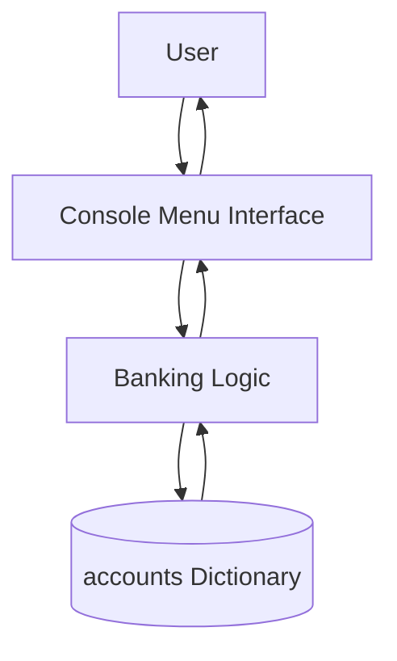

# System Architecture

## Simple Bank Management System

The project follows a simple single-program architecture.

### 1. Presentation Layer
The console interface displays menus and prompts and receives user input through `input()`.

### 2. Application Logic
The main Python control flow processes account creation, login, account details, deposits, withdrawals, transfers, logout, and exit operations.

### 3. Data Layer
The `accounts` dictionary acts as the data store. It keeps account records in memory while the application is running.

### Architecture Characteristics
- Single Python program
- Console-based interface
- In-memory data storage
- No external database
- No external API
- Menu-driven control flow

The architecture is intentionally simple and is suitable for demonstrating core Python programming concepts.
