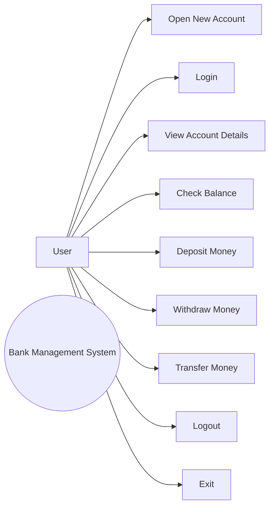

# Use Case

## Simple Bank Management System

### Actors
- **User:** Creates an account, logs in, and performs banking operations.
- **System:** Validates inputs, manages account records, and performs transactions.

### Use Case Diagram

### Use Case: Open New Account
**Precondition:** The program is running.

**Main Flow:**
1. User selects Open New Account.
2. User enters name and mobile number.
3. User creates a four-digit PIN.
4. System validates the PIN.
5. System creates the account.
6. System displays the account number.

**Alternative Flow:** If the PIN is not exactly four digits or contains non-numeric characters, the system displays an error.

### Use Case: Login
**Precondition:** An account has been created.

**Main Flow:**
1. User selects Login.
2. User enters account number and PIN.
3. System checks the account number.
4. System verifies the PIN.
5. System opens the account menu.

### Use Case: Deposit Money
**Precondition:** User is logged in.

1. User selects Deposit.
2. User enters an amount.
3. System checks that the amount is positive.
4. System adds the amount to the balance.
5. System displays the new balance.

### Use Case: Withdraw Money
**Precondition:** User is logged in.

1. User selects Withdraw.
2. User enters an amount.
3. System validates the amount.
4. System checks available balance.
5. System subtracts the amount if sufficient funds exist.

### Use Case: Transfer Money
**Precondition:** User is logged in.

1. User enters the receiver account number.
2. System checks whether the receiver exists.
3. System prevents transfers to the same account.
4. User enters the transfer amount.
5. System checks the balance.
6. System updates both accounts.
