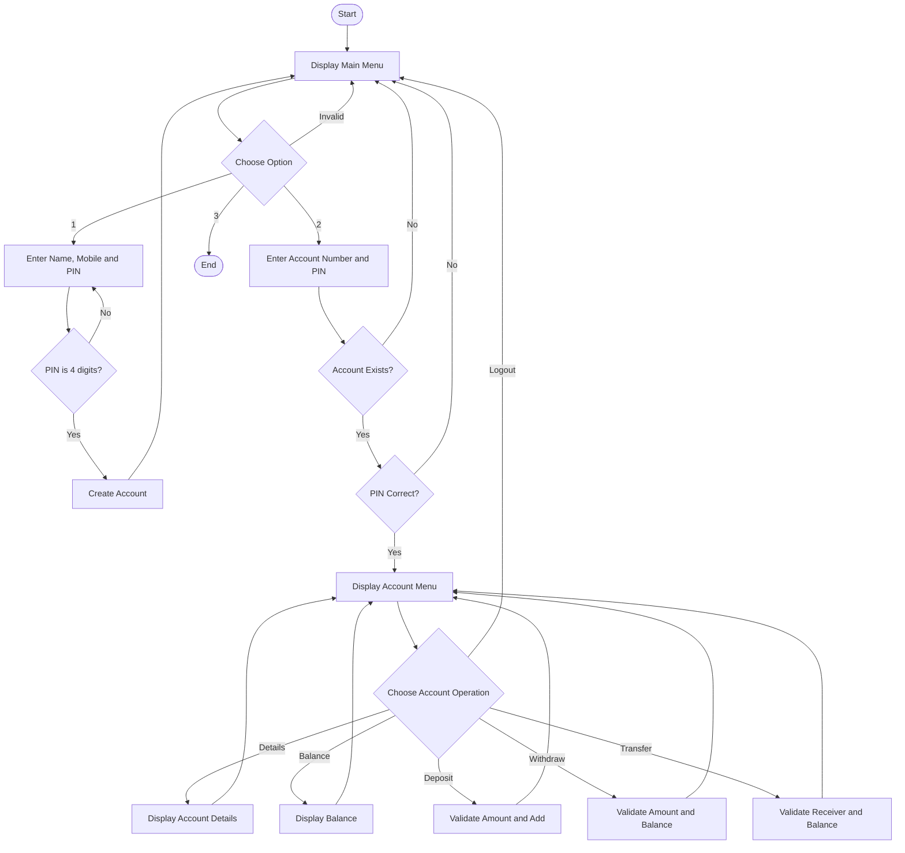

# Workflow

## Simple Bank Management System

### Overall Workflow
The program starts by displaying the main menu. The user can create an account, log in, or exit. After successful login, the account menu remains active until the user chooses logout. Banking operations update the account data stored in the `accounts` dictionary. The program returns to the main menu after logout and ends when the user chooses Exit.
